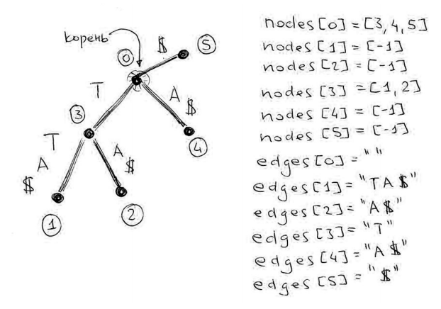

# Лекция: программирование в Python

## 1 Общая информация о Python

* Python - *интерпретируемый* язык
* Две версии в активной разработке: 2 и 3
    - в работе с текстами проще использовать версию 3 за счёт того что все строки в Unicode
    - далее в лекции примеры даны в python 3
    
### Немного о ссылках

* Каждая переменная - указатель на область памяти


```python
a = [1, 2, 3]
b = a

a.append(4)

print(b)
```

    [1, 2, 3, 4]


## 2 Работа со строками, файлами, коллекциями

### Самые топовые операции


```python
print( '  abc '.strip() ) # обрезать пробелы
print( 'abc'.replace('a', 'b') ) # замена символа
print( 'ab' in 'abc') # проверка присутствия подстроки
print( [char.upper() for char in 'abcd'] ) # пройтись посимвольно коротким for, применив операцию
print( 'Hello %s, %i and %0.2f' % ('MIPT', 2, 4.5555)) # format
print( 'A file with\nseveral\nlines'.splitlines() ) # разделить строку по \n
```

    abc
    bbc
    True
    ['A', 'B', 'C', 'D']
    Hello MIPT, 2 and 4.56
    ['A file with', 'several', 'lines']


### Считывание строк файла без \n


```python
lines = open('example.txt').read().splitlines()
print(lines)
```

    ['>Rosalind_4414', 'DEHKFRYNRCCFNYWMWRITIQKDKGNGRIQPDNVPWDVKSFVCNQTFQNKFGYLVAYIF', 'WRMTTEVKVWLKRMIYCRYWLLQIAMMEDKAFKGFCQHQNSWCMWNQGLYKFIIGFMCYC']


### Символ -> число (код ASCII)


```python
print(ord('A'))
print(ord('B'))
print(ord('Z'))
```

    65
    66
    90


```python
a = {
    'A': 1,
    'B': 2,
    'C': [1,2,3],
    'D': {
        'E': [4,5,6]
    }
}

print(a)

a.keys()

a['A']

b = [1,2,3,3]
[elem for elem in b]

{elem: '1' for elem in b}
```

    {'C': [1, 2, 3], 'B': 2, 'D': {'E': [4, 5, 6]}, 'A': 1}


    {1: '1', 2: '1', 3: '1'}


### Получение набора символов


```python
import string
import numpy

print(string.ascii_uppercase)
print([char for char in string.ascii_uppercase])

# also call `help(string)`

```

    ABCDEFGHIJKLMNOPQRSTUVWXYZ
    ['A', 'B', 'C', 'D', 'E', 'F', 'G', 'H', 'I', 'J', 'K', 'L', 'M', 'N', 'O', 'P', 'Q', 'R', 'S', 'T', 'U', 'V', 'W', 'X', 'Y', 'Z']


Пример получения словаря символов белка (обратите внимание на `enumerate`):


```python
string.ascii_uppercase

needed_chars = []
for char in string.ascii_uppercase:
    if char not in non_protein_chars:
        needed_chars.append(char)
print(needed_chars)
```

    ['A', 'C', 'D', 'E', 'F', 'G', 'H', 'I', 'K', 'L', 'M', 'N', 'P', 'Q', 'R', 'S', 'T', 'V', 'W', 'Y']


```python
for i, elem in enumerate(b):
    print(elem)
    
set([1,2,3,3])

print(['g', 'h', 'j'])
print(tuple(['g', 'h', 'j']))

c = [
    [0, 0, 0],
    [0, 0, 0],
    [0, 0, 0]
]
d = [
    [0, 0, 0],
    [0, 0, 0],
    [0, 0, 0]
]

e = [
    [(0, 0), (0, 1), (0, 1)],
    [(0, 1), (0, 1), (0, 1)],
    [(0, 1), (0, 1), (0, 1)]
]

n = 3
m = 4

[[(0,0)]*n]*m
```

    1
    2
    3
    3
    ['g', 'h', 'j']
    ('g', 'h', 'j')


    [[(0, 0), (0, 0), (0, 0)],
     [(0, 0), (0, 0), (0, 0)],
     [(0, 0), (0, 0), (0, 0)],
     [(0, 0), (0, 0), (0, 0)]]


```python
non_protein_chars = ['B', 'J', 'O', 'U', 'X', 'Z']
protein_chars = [char for char in string.ascii_uppercase if char not in non_protein_chars]
print(protein_chars)

print('\n')

protein_dict = {char: i + 1 for i, char in enumerate(protein_chars) }  # +1 because enumerate starts with 0
print(protein_dict)

print(len(protein_dict.keys()))
protein_dict['i'] = 7

print(protein_dict)
```

    ['A', 'C', 'D', 'E', 'F', 'G', 'H', 'I', 'K', 'L', 'M', 'N', 'P', 'Q', 'R', 'S', 'T', 'V', 'W', 'Y']
    
    
    {'T': 17, 'R': 15, 'P': 13, 'D': 3, 'M': 11, 'S': 16, 'L': 10, 'E': 4, 'Y': 20, 'V': 18, 'F': 5, 'W': 19, 'N': 12, 'Q': 14, 'C': 2, 'H': 7, 'G': 6, 'I': 8, 'A': 1, 'K': 9}
    20
    {'T': 17, 'R': 15, 'i': 7, 'P': 13, 'D': 3, 'M': 11, 'S': 16, 'L': 10, 'E': 4, 'Y': 20, 'V': 18, 'F': 5, 'W': 19, 'N': 12, 'Q': 14, 'C': 2, 'H': 7, 'G': 6, 'I': 8, 'A': 1, 'K': 9}


### Немного про dict

Хеш-таблица, получение элемента по ключу за $O(1)$


```python
print(protein_dict.keys())

for key, item in protein_dict.items():
    print('%s: %i' % (key, item))
    
print('\n')
print(protein_dict['C'])
```

    dict_keys(['T', 'R', 'P', 'D', 'M', 'S', 'L', 'E', 'Y', 'V', 'F', 'W', 'N', 'Q', 'C', 'H', 'G', 'I', 'A', 'K'])
    T: 17
    R: 15
    P: 13
    D: 3
    M: 11
    S: 16
    L: 10
    E: 4
    Y: 20
    V: 18
    F: 5
    W: 19
    N: 12
    Q: 14
    C: 2
    H: 7
    G: 6
    I: 8
    A: 1
    K: 9
    
    
    2


## 3 Рекурсия

- функция вызывает саму себя
- классический пример - вычисление n-го числа Фибоначчи


```python
def fib(n):
    if n==1 or n==2:
        return 1
    return fib(n-1) + fib(n-2)

print(fib(9))
```

    34


- также нужно в работе со словарями произвольной вложенности (чем является формат JSON)


```python
json_dict_example = {
    'start': {
        'next': {
            'hello': 1,
            'MIPT': 2
        }
    },
    
     'finish': {
        'final' : 3
    }
}

print(json_dict_example)
print('\n')

def print_dict_items(json_element):
    if type(json_element) != dict:
        print(json_element)
        return
    
    for key, item in json_element.items():
        print_dict_items(item)
    
    
    
print_dict_items(json_dict_example)
```

    {'finish': {'final': 3}, 'start': {'next': {'hello': 1, 'MIPT': 2}}}
    
    
    3
    1
    2


## 4 Обход суффиксного дерева

 Подсчёт потомков




```python
nodes = [
    [3,4,5],
    [],
    [],
    [1, 2],
    [],
    []
]

edges = [
    "",
    "TA$",
    "A$",
    "T",
    "A$",
    "$"
]

def leaves_count(i, nodes):
    if len(nodes[i]) == 0:
        return 1
    
    count = 0
    for j in nodes[i]:
        count += leaves_count(j, nodes)
        
    return count
    
print(leaves_count(0, nodes))
```

    4


## 5 Читабельность кода

* Вы пишете код для других
* Понятные имена переменных (не бойтесь, что получается не очень коротко)
* Константы с понятными именами - это хорошо

```
DOWN = '|'
RIGHT = '-'
DIAGONAL = '/'
```
     и если захочется поменять '-' на '*', не придётся делать опасный FIND & REPLACE
     
* Комментарии к **алгоритмам** - это хорошо
* PEP style guide: https://www.python.org/dev/peps/pep-0008/
* Меньше if'ов и ветвлений, например:


```python
def foo_bad(arg):
    if arg == 'a':
        print('arg is a')
    else:
        print('arg is not a')
        
def foo_good(arg):
    if arg == 'a':
        print('arg is a')
        return
    print('arg is not a')

foo_bad('a')
foo_bad('b')

print('\n')

foo_bad('a')
foo_bad('c')


```

    arg is a
    arg is not a
    
    
    arg is a
    arg is not a

